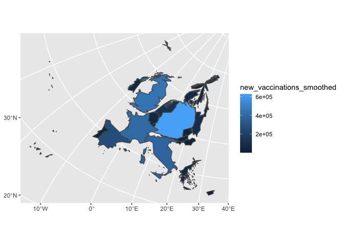

# Vaccination Cartogram - Europe - 2021-12-29

    ## Coordinate Reference System:
    ##   User input: +proj=longlat +ellps=WGS84 +towgs84=0,0,0,0,0,0,0 +no_defs 
    ##   wkt:
    ## GEOGCRS["unknown",
    ##     DATUM["World Geodetic System 1984",
    ##         ELLIPSOID["WGS 84",6378137,298.257223563,
    ##             LENGTHUNIT["metre",1]],
    ##         ID["EPSG",6326]],
    ##     PRIMEM["Greenwich",0,
    ##         ANGLEUNIT["degree",0.0174532925199433],
    ##         ID["EPSG",8901]],
    ##     CS[ellipsoidal,2],
    ##         AXIS["longitude",east,
    ##             ORDER[1],
    ##             ANGLEUNIT["degree",0.0174532925199433,
    ##                 ID["EPSG",9122]]],
    ##         AXIS["latitude",north,
    ##             ORDER[2],
    ##             ANGLEUNIT["degree",0.0174532925199433,
    ##                 ID["EPSG",9122]]]]

    ## Coordinate Reference System:
    ##   User input: EPSG:23038 
    ##   wkt:
    ## PROJCRS["ED50 / UTM zone 38N",
    ##     BASEGEOGCRS["ED50",
    ##         DATUM["European Datum 1950",
    ##             ELLIPSOID["International 1924",6378388,297,
    ##                 LENGTHUNIT["metre",1]]],
    ##         PRIMEM["Greenwich",0,
    ##             ANGLEUNIT["degree",0.0174532925199433]],
    ##         ID["EPSG",4230]],
    ##     CONVERSION["UTM zone 38N",
    ##         METHOD["Transverse Mercator",
    ##             ID["EPSG",9807]],
    ##         PARAMETER["Latitude of natural origin",0,
    ##             ANGLEUNIT["degree",0.0174532925199433],
    ##             ID["EPSG",8801]],
    ##         PARAMETER["Longitude of natural origin",45,
    ##             ANGLEUNIT["degree",0.0174532925199433],
    ##             ID["EPSG",8802]],
    ##         PARAMETER["Scale factor at natural origin",0.9996,
    ##             SCALEUNIT["unity",1],
    ##             ID["EPSG",8805]],
    ##         PARAMETER["False easting",500000,
    ##             LENGTHUNIT["metre",1],
    ##             ID["EPSG",8806]],
    ##         PARAMETER["False northing",0,
    ##             LENGTHUNIT["metre",1],
    ##             ID["EPSG",8807]]],
    ##     CS[Cartesian,2],
    ##         AXIS["(E)",east,
    ##             ORDER[1],
    ##             LENGTHUNIT["metre",1]],
    ##         AXIS["(N)",north,
    ##             ORDER[2],
    ##             LENGTHUNIT["metre",1]],
    ##     USAGE[
    ##         SCOPE["Engineering survey, topographic mapping."],
    ##         AREA["Europe - between 42°E and 48°E - Turkey."],
    ##         BBOX[36.97,42,41.6,44.83]],
    ##     ID["EPSG",23038]]

    ggplot() +
      geom_sf(data = cartogram, aes(fill = new_vaccinations_smoothed))

